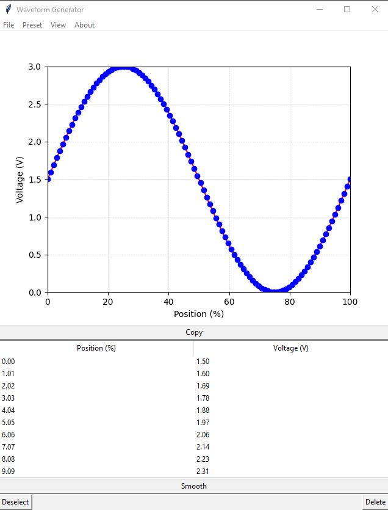

# DT71 Waveform Configurator

Just a quick program I made to generate the hexadecimal points needed to define a user waveform in the CAL.INI file for the Miniware DT71 Mini Digital Tweezers. It lets you define the points in a GUI graph and table, then export the generated text to the clipboard. 

I assume that, since the frequency is defined elsewhere in the INI file, you would usually want to use this program to create one repetition of the waveform (although you may be able to effectively achieve higher frequencies by defining multiple).

The following README was generated by ChatGPT:

This is a Python-based graphical user interface (GUI) application designed for generating and customizing waveforms, specifically tailored for the Miniware DT71 Mini Digital Tweezers. It allows users to define waveforms graphically and through a table interface, with the ability to export the generated waveform data directly to the clipboard for use in the CAL.INI file of the DT71. The program supports creating a single repetition of the waveform, with potential for defining multiple repetitions to achieve higher frequencies indirectly.

## Features

- Define and customize waveforms with adjustable resolution
- Preset waveforms: sine, sawtooth, triangle, and square
- Smooth peaks by adding additional points around the selected point
- Editable table for modifying point values
- Export waveform configuration in appropriate format for CAL.INI
- Configure grid settings for X and Y axes
- Load waveforms
- Snap to grid for precise editing
- Adjustable waveform resolution

## Installation

1. **Clone the repository:**

   ```bash
   git clone https://github.com/yourusername/waveform-generator.git
   cd waveform-generator
   ```

2. **Set up the virtual environment and install dependencies:**

   For Windows, run the provided batch script:

   ```bash
   setup.bat
   ```

   Alternatively, you can manually create a virtual environment and install dependencies:

   ```bash
   python -m venv venv
   venv\Scripts\activate
   pip install matplotlib numpy pyperclip scipy tkinter
   ```

3. **Ensure Tkinter is installed:**
   Tkinter should be included with your Python installation. If you encounter issues, refer to the [Tkinter installation guide](https://tkdocs.com/tutorial/install.html) for your operating system.

## Usage

1. **Activate the virtual environment:**

   ```bash
   venv\Scripts\activate
   ```

2. **Run the application:**

   ```bash
   python waveform_generator.py
   ```

3. **Interact with the GUI:**

   - **Menu Bar:**
     - **File**: Exit the application
     - **Preset**: Choose a waveform preset (Sine Wave, Sawtooth Wave, Triangle Wave, Square Wave)
     - **View**: Configure grid settings (Grid X and Grid Y, with options for enabling/disabling and setting intervals)

   - **Graph Interaction:**
     - Left-click to add or update a point
     - Right-click near a point to delete it

   - **Buttons:**
     - **Copy**: Copy the waveform data to the clipboard
     - **Smooth**: Smooth the selected peak (currently disabled)
     - **Deselect**: Deselect the selected row in the table
     - **Delete**: Delete the selected point

   - **Table**: Double-click to edit point values. Select a row to enable the "Delete" and "Deselect" buttons.

## Screenshots



## Contributing

1. Fork the repository
2. Create your feature branch (`git checkout -b feature/AmazingFeature`)
3. Commit your changes (`git commit -m 'Add some AmazingFeature'`)
4. Push to the branch (`git push origin feature/AmazingFeature`)
5. Open a pull request

(end of automated README contents) 

## License
Feel free to do whatever you wish with this code. 

## Obligatory disclaimer
This software is provided "as is" without any guarantees or warranty. Although we strive to ensure that the software operates correctly and without errors, we cannot guarantee its reliability, accuracy, or suitability for any purpose. Users are advised not to rely on this software for critical or serious uses, including but not limited to medical, safety-critical, or mission-critical applications, where a malfunction or error could result in significant harm, damage, or loss.

The developers and distributors of this software disclaim all responsibility and liability for any loss or damage resulting from its use. By using this software, you acknowledge and accept that it is used at your own risk.
